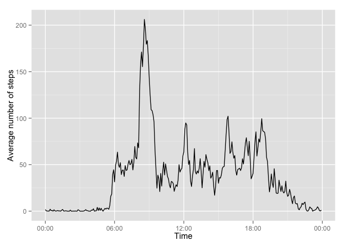
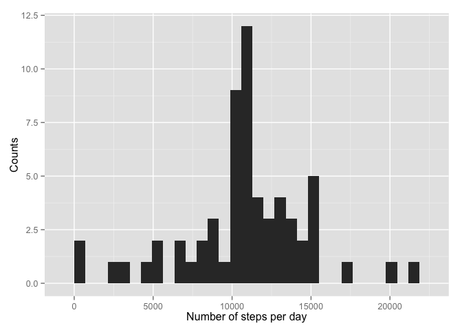

# Reproducible Research: Peer Assessment 1


```r
require(ggplot2)
```

```
## Loading required package: ggplot2
```

```
## Warning: package 'ggplot2' was built under R version 3.1.3
```

```r
library(scales)
library(dplyr)
```

```
## 
## Attaching package: 'dplyr'
## 
## The following object is masked from 'package:stats':
## 
##     filter
## 
## The following objects are masked from 'package:base':
## 
##     intersect, setdiff, setequal, union
```

```r
setwd("/Users/alibagherpour/Documents/LearnR/Reproducible Research/RepData_PeerAssessment1")
```

## Loading and preprocessing the data

```r
ActivityData <- read.csv("./activity.csv")
```


## What is mean total number of steps taken per day?


```r
StepPerDay <- aggregate(ActivityData$steps, by=list(ActivityData$date), FUN = sum,
                        na.rm=FALSE)
qplot(x, data=StepPerDay, geom="histogram", ylab = "Counts",
      xlab = "Number of steps per day")
```

 

Mean and median of the total number of steps taken per day

```r
MeanSteps <- mean(StepPerDay$x,na.rm=TRUE)
MedianSteps <- median(StepPerDay$x,na.rm=TRUE)
```
Mean and median of the total number of steps taken per day are 10766.19 
and 10765, respectively.


## What is the average daily activity pattern?

```r
ActivityData$interval <- formatC(ActivityData$interval, width = 4, format = "d", flag = "0")
ActivityData$interval <- as.POSIXct(ActivityData$interval, format="%H%M")
StepsTimeSeries <- aggregate(ActivityData$steps, by=list(ActivityData$interval), 
                             FUN = "mean",na.rm=TRUE)

ggplot(StepsTimeSeries, aes(Group.1,x)) + geom_line() + 
        scale_x_datetime(labels = date_format("%H:%M")) + xlab("Time") +
        ylab("Average number of steps") 
```

 

```r
MaxActivityTime <- StepsTimeSeries$Group.1[which.max(StepsTimeSeries$x)]
```
Maximum number of steps on average happens at 08:35 AM.

## Imputing missing values
The total number of missing values in dataset is 2304. The total number of reported values is 17568.


```r
ActivityDataReplaceNA <- ActivityData %>% 
            group_by(interval) %>%
            mutate(steps= replace(steps, is.na(steps), mean(steps, na.rm=TRUE)))
```
As shown in the code, the mean for 5-minute intervals was used to fill in all of the missing values in the dataset.


```r
StepPerDayReplaceNA <- aggregate(ActivityDataReplaceNA$steps, 
                                 by=list(ActivityDataReplaceNA$date),
                                 FUN = sum,na.rm=FALSE)
qplot(x, data=StepPerDayReplaceNA, geom="histogram", ylab = "Counts",
      xlab = "Number of steps per day")
```

 

Calculating mean and median of the total number of steps taken per day when the missing data was replaced:

```r
MeanStepsReplaceNA <- mean(StepPerDayReplaceNA$x,na.rm=FALSE)
MedianStepsReplaceNA <- median(StepPerDayReplaceNA$x,na.rm=TRUE)
```
Mean and median of the total number of steps taken per day are 10766.19 and 10766.19, respectively.


## Are there differences in activity patterns between weekdays and weekends?
